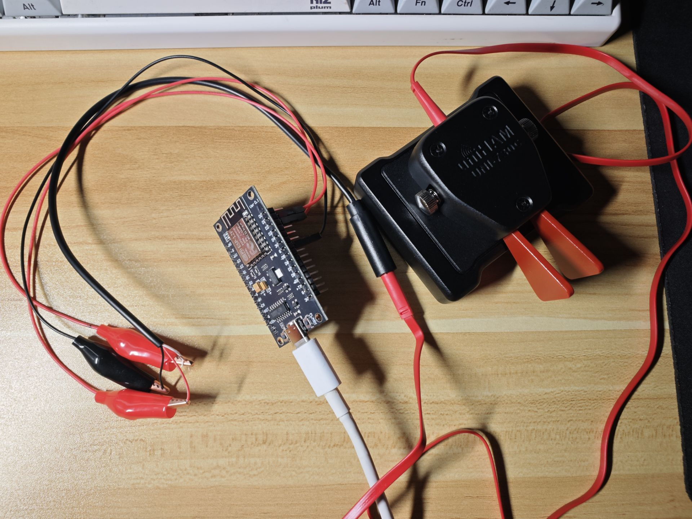

cw-keyer
===

Morse Code keyer and visualizer.

Supported keyer modes: Iambic A, Iambic B, Ultimatic and Straight.

## Keyer

`keyer` is a state machine program. It receives events from stdin and produces events to stdout.

Input events (4):

`dit down`, `dit up`, `dah down`, `dah up`

which basically indicates if the dit/dah paddle is pressed.

Output events (10):

- `dit down`/`dit up`/`dah down`/`dah up`: just echoes of stdin
- `dit`, `dah`: a dit/dah is recognized
- `key on`, `key off`: output key (tone) starts/stops
- `char`, `word`: indicates the boundary of a character/word

## Visualizer

The `visualizer` GUI subproject receives stdin events:

- `dit down`, `dit up`, `dah down`, `dah up`
- `key on`, `key off`

and draws a representation of the dit/dah/tone lanes in realtime to demonstrate the timing.

## Building

```shell
cargo build && cargo build --manifest-path=visualizer/Cargo.toml 
```

## Usage

Some interesting things can be done with programs above and these Python scripts altogether.

- `audio-out.py`: play tones according to `key on` and `key off` from stdin
- `gamepad-pipe.py`: map two buttons of my gamepad to these four paddle events (`(dit|dah) (down|up)`)
- `interface/read-serial.py`: read bytes sent from an ESP8266 chipboard, from `/dev/ttyUSBx`, and map them to these four paddle events

### Dual-lever Paddle

I literally grabbed a $1.5 ESP8266 and made it the keyer interface.

So first, grab an ESP8266, and program it:

```shell
arduino-cli compile --fqbn esp8266:esp8266:nodemcuv2 interface
arduino-cli upload -p /dev/ttyUSB0 --fqbn esp8266:esp8266:nodemcuv2 interface
```

Then set things up like this:



Pins and mappings:

- D1 low: dit down - 0x01
- D1 high: dit up - 0x02
- D2 low: dah down - 0x03
- D2 high: dah up - 0x04

Corresponding byte will be sent to the serial @ 115200 baud. Read them using `interface/read-serial.py`.

Combine things together:

```shell
interface/read-serial.py | target/debug/keyer -m ultimatic -w25 | pee ./audio-out.py visualizer/target/debug/visualizer ./decoder-wtype.py
```

Demonstration:

https://github.com/user-attachments/assets/705f1c97-b0cd-46f4-8ca8-9ef8e77a5c2d

Note the `./decoder-wtype.py` is optional. It receives `dit`, `dah`, `char`, `word` events and decodes them, and use [`wtype`](https://github.com/atx/wtype) to type on Wayland.

### Gamepad

Similar to above:

```shell
./gamepad-pipe.py | target/debug/keyer -m ultimatic -w25 | pee ./audio-out.py visualizer/target/debug/visualizer ./decoder-wtype.py
```

Demonstration:

https://github.com/user-attachments/assets/ac062851-90dc-44a0-9037-f2af451fb485

## Notes

I use this as a software-defined Morse keyer solution. Stuff is _mostly_ vibe coded with OpenCode:deepseek-v4-pro - fair warning. The README however, is written by me all by-hand :).

The project is inspired by <https://www.youtube.com/watch?v=Hn4j2nfdKNE> and their <https://didahdit.com> website.
